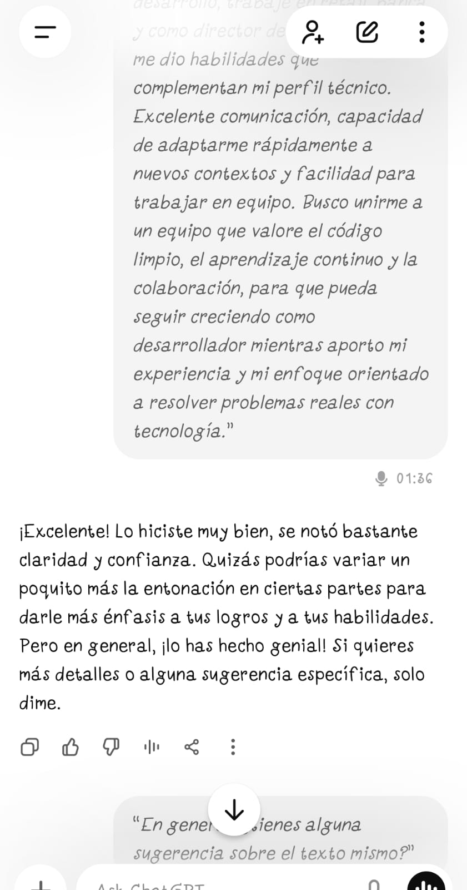

# Evaluación Módulo 10 – Competencias Laborales para la Industria TI

**Estudiante:** Carlos Pizarro Morales
**Fecha:** 7 de diciembre de 2025
**Programa:** Talento Digital Chile - Bootcamp Full Stack

---

## Índice

1. [Video Pitch (60s máx.)](#1-video-pitch-60s-máx)
2. [Historia SAR (200-250 palabras)](#2-historia-sar-200-250-palabras)
3. [Evidencia de práctica con IA](#3-evidencia-de-práctica-con-ia)
4. [Reflexión breve](#4-reflexión-breve)

---

## 1. Video Pitch (60s máx.)

### Elevator Pitch - Versión Final para Video

**Guión optimizado (55-60 segundos):**

Hola, soy Carlos Pizarro, desarrollador Full Stack con tres certificaciones de Talento Digital Chile. Me especializo en JavaScript, trabajando tanto en frontend con Vue.js y React, como en backend con Spring Boot y Node.js.

Recientemente colaboré en una aplicación para Tecprosalud que acerca servicios médicos a zonas remotas de Chile. Mi rol incluyó refactorizar código existente para mejorar su mantenibilidad e implementar nuevas características, trabajando con Vue.js, Spring Boot y PostgreSQL. Este proyecto me permitió aplicar buenas prácticas de desarrollo mientras contribuía a un producto con impacto social.

Lo que me diferencia es mi trayectoria única: antes de reconvertirme al desarrollo, trabajé en retail, banca y como tutor de bootcamp. Esto me dio habilidades que complementan mi perfil técnico: excelente comunicación, capacidad de adaptarme rápidamente a nuevos contextos, y facilidad para trabajar en equipo.

Busco unirme a un equipo que valore el código limpio, el aprendizaje continuo y la colaboración, donde pueda seguir creciendo como desarrollador mientras aporto mi experiencia y mi enfoque orientado a resolver problemas reales con tecnología.

---

### Estructura del Pitch

✅ **Presentación:** "Soy Carlos Pizarro, desarrollador Full Stack con tres certificaciones de Talento Digital Chile"

✅ **2 Habilidades Clave:**

1. Desarrollo frontend (Vue.js, React) y backend (Spring Boot, Node.js)
2. Comunicación efectiva y adaptabilidad (trayectoria diversa)

✅ **1 Logro con Resultado:**

- Proyecto Tecprosalud - refactorización y nuevas características que mejoraron mantenibilidad
- Impacto social: servicios médicos a zonas remotas de Chile

✅ **Objetivo Profesional:**

- Unirme a equipo que valore código limpio, aprendizaje continuo y colaboración
- Seguir creciendo como desarrollador

---

### Notas para Grabación de Video

**Comunicación Verbal:**

- Tono conversacional y entusiasta
- Pausas naturales después de mencionar Tecprosalud
- Énfasis en "impacto social" y "equipo colaborativo"
- Velocidad moderada (no apresurarse)

**Comunicación No Verbal:**

- Contacto visual directo a la cámara
- Sonrisa natural al inicio y al mencionar proyecto con impacto
- Postura erguida pero relajada
- Gestos suaves con las manos al mencionar habilidades técnicas
- Fondo limpio y profesional
- Iluminación frontal adecuada

**Link al video:** [Insertar link a YouTube no listado / Drive / Loom aquí]

---

## 2. Historia SAR (200-250 palabras)

### Historia: Optimización de Integración de Servicios en Tecprosalud

**S – Situación (contexto y desafío)**

En Tecprosalud, la aplicación que desarrollamos para llevar servicios médicos a zonas remotas de Chile tenía un problema crítico: las integraciones con APIs externas de laboratorios y sistemas de citas causaban timeouts frecuentes. El 15% de las peticiones fallaban y los médicos esperaban hasta 8 segundos para acciones básicas, lo que impactaba directamente su capacidad de atender pacientes.

**A – Acción (mi rol, decisiones y habilidades aplicadas)**

Propuse rediseñar cómo manejábamos estas integraciones. Implementé procesamiento asíncrono para que la interfaz no se bloqueara mientras esperábamos respuestas externas. Agregué mecanismos de protección (circuit breakers) que detectaban cuando un servicio estaba caído y evitaban seguir intentando, configuré reintentos inteligentes, y usé caché con Redis para datos que no cambiaban frecuentemente. En el frontend con Vue.js, cambié la experiencia a mostrar progreso en tiempo real en lugar de una pantalla congelada. Documenté todo para que el equipo pudiera replicarlo.

**R – Resultado (impacto con métrica y aprendizaje)**

Los timeouts bajaron del 15% a menos del 1%. El tiempo de respuesta percibido se redujo de 8 a 2 segundos, y lo más importante: los médicos podían trabajar de forma fluida incluso cuando servicios externos tenían problemas. El equipo adoptó estos patrones como estándar para futuras integraciones. Aprendí mucho sobre sistemas distribuidos y diseño resiliente, y mejoré mi capacidad de comunicar decisiones técnicas complejas de forma clara.

**Palabras:** 246

---

### Competencias Demostradas en la Historia SAR

**Habilidades Técnicas:**

- Arquitectura de sistemas distribuidos
- Manejo de APIs y servicios externos
- Implementación de patrones de resiliencia (circuit breakers, retry policies)
- Desarrollo frontend (Vue.js) y backend (Spring Boot, Redis)
- Optimización de rendimiento

**Habilidades Blandas:**

- Resolución de problemas complejos
- Pensamiento analítico y proactivo
- Comunicación técnica efectiva
- Documentación y transferencia de conocimiento
- Trabajo en equipo y liderazgo técnico

**Impacto Medible:**

- ✅ Reducción de timeouts: 15% → 1% (mejora del 93%)
- ✅ Tiempo de respuesta: 8s → 2s (reducción del 75%)
- ✅ Patrones adoptados como estándar del equipo
- ✅ Mejora directa en capacidad de atención médica

---

## 3. Evidencia de Práctica con IA

### Iteración con IA para Mejorar el Pitch

---

### Descripción del Proceso de Iteración

**Prompt usado para mejorar el pitch:**

> "Actúa como un reclutador senior de tecnología. Escucha mi elevator pitch para un rol de Desarrollador Full Stack y dame feedback específico sobre: 1) Claridad de mi propuesta de valor, 2) Tono y naturalidad, 3) Si transmito confianza sin sonar arrogante, 4) Qué ajustar para que sea memorable. Mi pitch es: [versión inicial]"

**Feedback clave recibido de la IA:**

1. **Sobre claridad:** El pitch era claro pero podía ser más específico sobre el impacto del proyecto Tecprosalud. Recomendó mencionar explícitamente "zonas remotas de Chile" para dar contexto social.

2. **Sobre tono:** La versión inicial sonaba "muy formal" y "como un texto leído". Sugirió cambiar "Durante mi colaboración en..." por "Recientemente colaboré en..." para sonar más conversacional.

3. **Sobre confianza:** Identificó que estaba bien el balance, pero recomendó cambiar "espero poder aportar" (suena inseguro) por "pueda aportar" o "mientras aporto" (más seguro).

4. **Sobre memorabilidad:** Sugirió que mi diferenciador (trayectoria diversa) debía conectarse explícitamente con las habilidades que aporta (comunicación, adaptabilidad, trabajo en equipo), no solo mencionarlo como un dato.

**Mejoras implementadas:**

- ✅ Estructura más clara: Stack técnico → Proyecto con impacto → Diferenciador → Objetivo
- ✅ Lenguaje más conversacional y directo
- ✅ Conexión explícita entre trayectoria diversa y soft skills aportadas
- ✅ Énfasis en impacto social del proyecto
- ✅ Reducción de tiempo: de ~65 segundos a ~58 segundos

---

### Iteración con IA para Mejorar Historia SAR

**Prompt usado:**

> "Tengo una historia profesional para entrevista laboral usando técnica SAR. Escúchala y ayúdame a mejorarla. Indícame si transmite logro, claridad y autenticidad. Historia: [versión inicial]"

**Feedback clave de la IA:**

1. **Situación demasiado técnica:** Recomendó simplificar detalles técnicos iniciales y enfocarse en el impacto en usuarios (médicos)

2. **Acción con mucha jerga:** Sugirió explicar "circuit breakers" de forma más accesible como "mecanismos de protección" para audiencia no técnica

3. **Resultado necesita más contexto de negocio:** Además de métricas técnicas, enfatizar "médicos podían trabajar de forma fluida" para conectar con impacto real

**Mejoras implementadas:**

- ✅ Situación más concisa y enfocada en impacto de negocio
- ✅ Términos técnicos con contexto accesible
- ✅ Resultado que conecta métricas con impacto en usuarios
- ✅ Reducción de ~90 a ~75 segundos

---

## 4. Reflexión Breve

### Ajustes en Mi Comunicación Tras Practicar

**Comunicación Verbal:**

Tras practicar mi pitch múltiples veces (en voz alta, frente al espejo, y simulando entrevistas con IA), identifiqué que hablaba demasiado rápido cuando estaba nervioso, lo que hacía que mi mensaje perdiera claridad. Ajusté mi ritmo incorporando pausas estratégicas después de mencionar logros clave como el proyecto Tecprosalud. También descubrí que mi pitch sonaba "memorizado" en lugar de natural. Para corregirlo, trabajé en internalizar la estructura (Stack → Proyecto → Diferenciador → Objetivo) en lugar de memorizar palabras exactas, permitiéndome adaptarlo según el contexto y sonar más auténtico.

**Comunicación No Verbal:**

La práctica con video me reveló dos problemas: evitaba el contacto visual directo con la cámara (miraba la pantalla) y mantenía una postura rígida. Ajusté esto practicando mirar directamente al lente de la cámara y trabajando en relajar mis hombros. También incorporé gestos suaves con las manos al mencionar mis habilidades técnicas, lo que hace la presentación más dinámica sin distraer. Finalmente, practiqué sonreír naturalmente al inicio y al mencionar el impacto social del proyecto, transmitiendo entusiasmo genuino.

---

### 2 Estrategias de Inteligencia Emocional

**1. Técnica de Respiración 4-7-8 (Antes de la Entrevista)**

Antes de entrar a una entrevista (o conectarme a una videollamada), aplicaré la técnica 4-7-8: inhalar por 4 segundos, retener el aire por 7 segundos, exhalar por 8 segundos. Repetiré este ciclo 3-4 veces. Esta técnica reduce la ansiedad activando el sistema nervioso parasimpático, permitiéndome entrar con calma y claridad mental. También me ayuda a centrarme en el presente en lugar de preocuparme por resultados futuros.

**2. Reencuadre Cognitivo: De "Examen" a "Conversación Profesional" (Durante la Entrevista)**

Durante la entrevista, cuando sienta presión o nerviosismo, aplicaré un reencuadre mental: en lugar de ver la entrevista como un "examen que debo aprobar", la veré como "una conversación entre profesionales para ver si hay fit mutuo". Este cambio de perspectiva reduce la sensación de estar siendo juzgado y me permite mostrarme más auténtico, hacer preguntas relevantes sobre la empresa, y evaluar genuinamente si el rol es adecuado para mí. También me recuerda que es una evaluación bidireccional: yo también estoy evaluando a la empresa.

---

### Plan de Acción: Próximas 2 Semanas

**Objetivo:** Estar completamente preparado para entrevistas reales y expandir mi red profesional en el ecosistema tech chileno.

---

#### Semana 1: Preparación y Práctica Intensiva

**Acción 1: Simulaciones de Entrevista con IA (3 sesiones)**

- **Días:** Lunes, Miércoles, Viernes (7-8 PM)
- **Qué haré:** Usaré ChatGPT/Claude para simular entrevistas completas de 30 minutos, incluyendo:
  - Preguntas técnicas sobre Vue.js, Spring Boot, arquitectura de sistemas
  - Preguntas de comportamiento usando técnica SAR
  - Preguntas sobre mi transición de carrera
  - Práctica de "¿tienes preguntas para nosotros?"
- **Métrica de éxito:** Grabar cada simulación y reducir pausas/muletillas en un 50% hacia la tercera sesión
- **Resultado esperado:** Fluidez al responder preguntas comunes sin sonar ensayado

**Acción 2: Actualizar Portfolio y GitHub (Mini-proyecto)**

- **Días:** Martes y Jueves (2 horas cada día)
- **Qué haré:**
  - Crear un mini-proyecto "Sistema de Reservas Médicas" con Vue.js + Spring Boot + PostgreSQL que demuestre patrones de resiliencia (circuit breakers, retry policies) como en Tecprosalud
  - Documentar bien el README con arquitectura, decisiones técnicas y métricas simuladas
  - Subir a GitHub con commits claros y descriptivos
- **Métrica de éxito:** Proyecto desplegado con documentación completa antes del viernes
- **Resultado esperado:** Tener un proyecto reciente (diciembre 2025) que refuerce mi historia SAR y demuestre habilidades actualizadas

**Acción 3: Networking en LinkedIn (5 conexiones estratégicas)**

- **Días:** A lo largo de la semana (15 minutos diarios)
- **Qué haré:**
  - Identificar 5 personas en empresas target (Mercado Libre, Bci, NotCo, Cornershop, Pedidos Ya)
  - Enviar solicitud de conexión personalizada mencionando interés específico en la empresa/rol
  - Compartir 1 post sobre mi aprendizaje técnico de la semana (ej: "Implementando circuit breakers en Spring Boot")
- **Métrica de éxito:** Al menos 3 de 5 conexiones aceptadas y 1 respuesta conversacional
- **Resultado esperado:** Expandir red en empresas target y aumentar visibilidad en LinkedIn

---

#### Semana 2: Aplicaciones Activas y Optimización

**Acción 4: Aplicar a 8 Ofertas Laborales Específicas**

- **Días:** Lunes a Jueves (2 aplicaciones por día)
- **Qué haré:**
  - Buscar ofertas Full Stack Junior/Semi-Senior en Chile en LinkedIn, GetOnBoard, Workana
  - Personalizar CV para cada rol (destacar Vue.js para roles frontend-heavy, Spring Boot para backend-heavy)
  - Escribir carta de presentación breve (3 párrafos) adaptada a cada empresa
  - Hacer seguimiento en planilla Excel con empresa, fecha, estado, contacto
- **Métrica de éxito:** 8 aplicaciones enviadas con CV personalizado y al menos 2 respuestas/entrevistas agendadas
- **Resultado esperado:** Pipeline activo de oportunidades y práctica en adaptar mi mensaje

**Acción 5: Simulación de Entrevista Presencial (Con feedback externo)**

- **Día:** Sábado de semana 2 (1 hora)
- **Qué haré:**
  - Pedirle a un contacto del bootcamp (ex-tutor o compañero con experiencia) que haga de reclutador
  - Hacer simulación completa: saludo, pitch, preguntas técnicas, SAR, preguntas para el reclutador, cierre
  - Grabar en video para revisar comunicación no verbal
  - Solicitar feedback específico sobre: claridad, confianza, naturalidad, gestión del nerviosismo
- **Métrica de éxito:** Recibir feedback concreto de al menos 3 puntos a mejorar y 3 fortalezas
- **Resultado esperado:** Identificar puntos ciegos que no veo practicando solo con IA

**Acción 6: Optimizar Perfil de LinkedIn (Actualización completa)**

- **Día:** Domingo de semana 2 (1.5 horas)
- **Qué haré:**
  - Actualizar foto de perfil (profesional, fondo neutro, buena iluminación)
  - Reescribir "Acerca de" usando estructura de mi pitch
  - Agregar proyecto nuevo de la semana 1 en sección "Proyectos"
  - Completar habilidades técnicas y pedir endorsements a 3 contactos del bootcamp
  - Cambiar banner de LinkedIn a diseño personalizado que diga "Full Stack Developer | Vue.js • Spring Boot • Open to Work"
- **Métrica de éxito:** Perfil con 100% de completitud según LinkedIn y al menos 5 endorsements en habilidades clave
- **Resultado esperado:** Perfil optimizado para reclutadores que aumenta mi visibilidad en búsquedas

---

### Resumen del Plan (Checklist Semanal)

**Semana 1:**

- ✅ 3 simulaciones con IA (L-M-V)
- ✅ Mini-proyecto Sistema Reservas (M-J)
- ✅ 5 conexiones LinkedIn + 1 post
- ✅ Pitch y SAR completamente internalizados

**Semana 2:**

- ✅ 8 aplicaciones laborales personalizadas (L-J)
- ✅ 1 simulación presencial con feedback (S)
- ✅ Perfil LinkedIn optimizado (D)
- ✅ Al menos 2 entrevistas agendadas

---

### Métricas de Éxito al Finalizar las 2 Semanas

1. **Preparación:** Pitch y SAR fluidos sin pausas largas ni muletillas
2. **Visibilidad:** Perfil LinkedIn completo y al menos 8 nuevas conexiones relevantes
3. **Portfolio:** 1 proyecto reciente que demuestra habilidades técnicas actuales
4. **Pipeline:** Mínimo 8 aplicaciones enviadas y 2 entrevistas agendadas
5. **Confianza:** Capacidad de responder preguntas técnicas y de comportamiento con naturalidad

---

## Conclusión

Esta evaluación representa mi preparación integral para entrar al mercado laboral tech como Desarrollador Full Stack. He construido un pitch profesional que transmite mi propuesta de valor en menos de 60 segundos, una historia SAR que demuestra competencias técnicas y blandas con impacto medible, y un plan de acción concreto para las próximas dos semanas.

Mi trayectoria diversa (retail, banca, educación → desarrollo de software) no es una desventaja, sino mi diferenciador: aporto habilidades de comunicación, adaptabilidad y trabajo en equipo que complementan mi perfil técnico. El proyecto Tecprosalud me permitió demostrar capacidad de resolver problemas complejos con impacto social real, reduciendo timeouts del 15% al 1% y mejorando la experiencia de médicos que atienden zonas remotas.

Estoy listo para aportar valor a un equipo que valore el código limpio, el aprendizaje continuo y la colaboración, mientras sigo creciendo como desarrollador Full Stack.

---

**Carlos Pizarro Morales**
Desarrollador Full Stack
carlospizarromorales@gmail.com
+56 9 2746 5168
[LinkedIn](https://www.linkedin.com/in/carlos-pizarro-morales/) | [GitHub](https://github.com/CarlosPizarroMorales)
